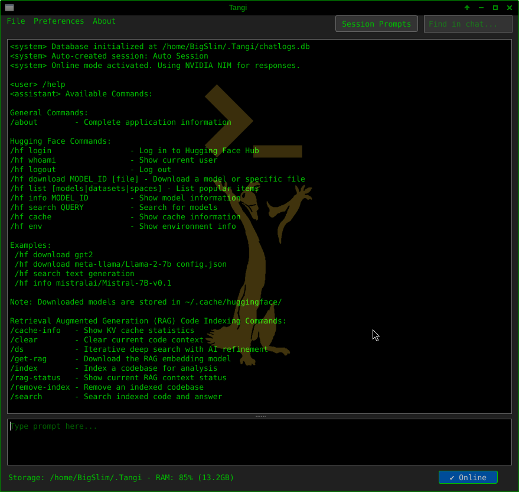

# Tangi

**Hardware-agnostic, auto-optimizing local AI assistant with RAG for codebases.**

[](https://opensource.org/licenses/MIT)
[](https://www.python.org/downloads/)
[](https://www.openblas.net/)

---

## Overview

Tangi is a local AI assistant designed for developers who want **fast, hardware-aware inference** and **code-aware answers**. It automatically detects system capabilities (CPU, threads, memory, BLAS backend) and tunes itself for optimal performance.

It includes a built-in **Retrieval-Augmented Generation (RAG)** system that indexes your codebase, enabling accurate, context-grounded responses.

---

## Features



*Main widget LLM Inference Demo*

### Hardware-Aware Optimization
- Automatic detection of physical vs logical CPU cores
- NUMA-aware scheduling (multi-socket systems)
- OpenBLAS auto-configuration
- Dynamic batch sizing based on RAM
- Optional memory locking to prevent swapping

### RAG System (Code Intelligence)

| Feature | Command | Use Case |
|--------|---------|----------|
| **Code Indexing** | `/index /path` | Index a codebase for semantic search |
| **Standard RAG** | `/search "question"` | Fast, single-pass retrieval for direct questions |
| **Deep Search** | `/ds "question"` | Multi-step iterative search for complex, cross-file analysis |

### Code Indexing
- Semantic search across codebases
- Multi-project support
- Automatic ignore rules (venv, node_modules, build artifacts)
- Chunk preview before querying

### Interface
- Markdown and plain chat modes
- Session persistence
- Theme support (dark/light)
- KV cache for faster repeated queries

### Performance
- OpenBLAS acceleration
- Thread coordination (avoids BLAS/LLM contention)
- Automatic token budgeting
- Context window management


## Installation

### Requirements
- Python 3.12+
- 8 GB RAM minimum (16 GB recommended)
- OpenBLAS (recommended)
- ~10 GB disk space for models

### Setup

```
git clone https://github.com/yourusername/Tangi.git
cd Tangi

python -m venv venv
source venv/bin/activate  # Windows: venv\Scripts\activate
```

Install dependencies:

```
# OpenBLAS
sudo apt install libopenblas-dev        # Debian/Ubuntu
# or
sudo emerge -av sci-libs/openblas       # Gentoo

pip install -r requirements.txt

# Rebuild llama-cpp-python with OpenBLAS
pip uninstall llama-cpp-python -y
CMAKE_ARGS="-DGGML_BLAS=ON -DGGML_BLAS_VENDOR=OpenBLAS" \
  pip install llama-cpp-python==0.3.16 --no-cache-dir
```

---

## Quick Start

```
python -m Tangi
```

1. **Load a model** (File → Load Model or select a .gguf file)
2. **Download the embedding model** (one-time setup): /get-rag
3. **Index your codebase**: /index /path/to/your/project
4. **Select the indexed codebase** (Manage Index → Select CodeBase)
5. **Ask questions!**

---

## RAG Workflow: When to Use Which Command

### Step 1: Index Your Codebase
```
/index /home/user/projects/myapp
```

### Step 2: Select Your Active Codebase
- Open **Manage Index** (File → Manage Index)
- Select your indexed project
- Click **Select CodeBase**

### Step 3: Choose the Right Search Command

#### Use /search for:
- Direct, factual questions
- Single file lookups
- Finding specific functions or classes
- Simple queries

#### Use /ds for:
- Complex, multi-file questions
- System architecture understanding
- Cross-module dependencies
- Troubleshooting complex issues

---

## Commands

### General
| Command | Description |
|--------|-------------|
| /about | Application information |
| /help or /commands | Show all commands |

### Hugging Face
| Command | Description |
|--------|-------------|
| /hf login | Authenticate |
| /hf download MODEL | Download model |
| /hf search QUERY | Search models |
| /hf info MODEL | Model details |
| /hf cache | Cache info |

### RAG
| Command | Description |
|--------|-------------|
| /index PATH | Index codebase |
| /search QUERY | Fast retrieval |
| /ds QUERY | Deep search |
| /get-rag | Download embeddings |
| /remove-index PATH | Remove index |
| /clear | Clear context |
| /rag-status | Status |
| /cache-info | Cache stats |

---

## Architecture

### Standard RAG
Query → Retrieve → Context → LLM → Answer

### Deep Search
Query → Retrieve → Analyze → Refine → Retrieve → ... → Answer

---

## Configuration

### Memory Usage
Default: 85% RAM

### Model Settings
```
optimal_settings = {
    'n_threads': auto-detected,
    'n_batch': auto-optimized,
    'use_mlock': based on system RAM,
}
```

---

## Performance Guidelines

| System | Threads | Batch | Context |
|-------|--------|------|--------|
| 2–4 cores | = cores | 64–128 | 8K–16K |
| 4–8 cores | cores +25% | 128–256 | 16K–32K |
| 8+ cores | 80–100% | 256–512 | 32K–128K |

---

## Contributing

```
git checkout -b feature/name
git commit -m "feature: description"
git push origin feature/name
```

---

## License

MIT License.

---

## Acknowledgments

- llama-cpp-python  
- sentence-transformers  
- OpenBLAS  

---

## Support

GitHub Issues for bugs and requests.

---

## Donations

BTC: 3GtCgHhMP7NTxsdNjcDs7TUNSBK6EXoAzz  
ETH: 0x5f1ed610a96c648478a775644c9244bf4e78631e  

---

Built by Michael Reinert
